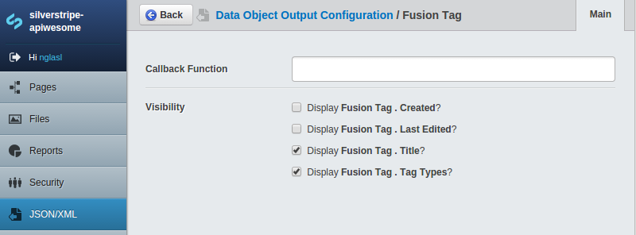
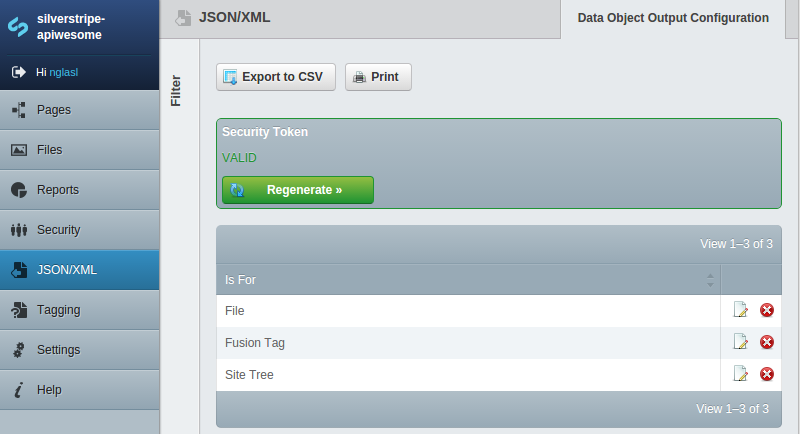
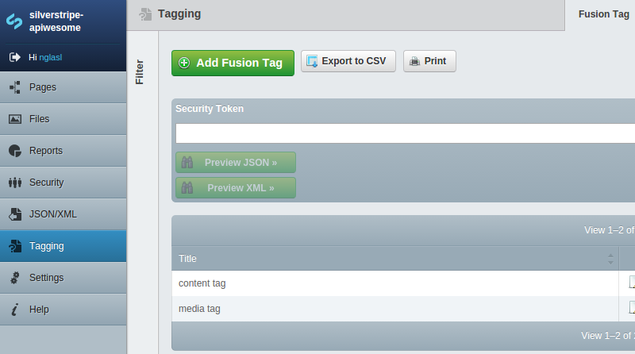

# [apiwesome](https://packagist.org/packages/nglasl/silverstripe-apiwesome)

_The current release is **2.0.1**_

	A module for SilverStripe which will automatically create customisable JSON/XML feeds
	for your data objects (including pages).

## Requirement

* SilverStripe 3.0.X or 3.1.X

## Getting Started

* Place the module under your root project directory.
* Define any custom JSON/XML data object exclusions/inclusions through project configuration.
* `/dev/build`
* Select `JSON/XML` through the CMS.
* Configure attribute visibility.
* `Regenerate` the security token `x:y`
* `/apiwesome/retrieve/data-object-name/json?token=x:y`
* `/apiwesome/retrieve/data-object-name/xml?token=x:y`

## Overview

### Data Object Exclusions/Inclusions

ALL data objects are included by default (excluding some core), unless disabled or inclusions have explicitly been defined.

```php
DataObjectOutputConfiguration::customise_data_objects('exclude', array(
	'DataObjectName'
));
```

```php
DataObjectOutputConfiguration::customise_data_objects('include', array(
	'DataObjectName'
));
```

```php
DataObjectOutputConfiguration::customise_data_objects('disabled');
```

### Attribute Visibility Customisation



The JSON/XML feed will only be available to data objects with attribute visibility set through the CMS. Any `has_one` relationships may be displayed, where attribute visibility is determined recursively.

#### Recursive Relationships

These are enabled by default, however will greatly impact performance if many nested relationships are visible.

To disable the recursion:

```yaml
Injector:
  APIwesomeService:
    properties:
      recursiveRelationships: false
```

### Security Token

A JSON/XML feed request will require the current security token passed through, where this may be regenerated by an administrator (invalidating the previous security token).



### Output

A JSON/XML feed request may have a number of optional filters applied, where the `&filter` will only apply to visible attributes:

* `&limit=5`
* `&sort=Attribute,ORDER`
* `&filter1=value`
* `&filter2=value`

It may also be previewed through the appropriate model admin of your data object.



#### Pretty JSON

This is enabled by default, however will slightly impact performance if many nested relationships are visible.

To disable the pretty printing:

```yaml
Injector:
  APIwesomeService:
    properties:
      prettyJSON: false
```

### Developer Functionality

#### PHP

Accessing the service:

```php
$service = Singleton('APIwesomeService');
```

The methods available may be programmatically called to generate JSON, with optional filters:

```php
$JSON = $service->retrieve('DataObjectName', 'JSON');
$JSON = $service->retrieve('DataObjectName', 'JSON', 5, array(
	'Attribute',
	'ORDER'
), array(
	'Attribute1' => 'value',
	'Attribute2' => 'value'
));
```

```php
$objects = DataObjectName::get()->toNestedArray();
$JSON = $service->retrieveJSON($objects);
```

XML, with optional filters:

```php
$XML = $service->retrieve('DataObjectName', 'XML');
$XML = $service->retrieve('DataObjectName', 'XML', 5, array(
	'Attribute',
	'ORDER'
), array(
	'Attribute1' => 'value',
	'Attribute2' => 'value'
));
```

```php
$objects = DataObjectName::get()->toNestedArray();
$XML = $service->retrieveXML($objects);
```

JSON/XML for a versioned page (though the CMS may not correctly preview XML), with regard to the respective stage in `index()`:

```php
return $service->retrieveStaged($this->data()->ID, 'JSON');
```

They may also be used to parse JSON/XML from another APIwesome instance. Therefore, this module may be used as both an API and external connector between multiple projects.

```php
$objects = $service->parseJSON($JSON);
```

```php
$objects = $service->parseXML($XML);
```

#### jQuery

JSON example:

```javascript
;(function($) {
	$(window).load(function() {

		$.getJSON('//ss3.1/apiwesome/retrieve/data-object-name/json?token=' + token(), function(JSON) {

			// Iterate over each data object.

			if(JSON['APIwesome'] !== undefined) {
				$.each(JSON['APIwesome']['DataObjects'], function(index, object) {

					// The JSON feed security token is no longer valid!

					if((index === 'Expired') && (object === true)) {
						return false;
					}

					// Iterate over each visible attribute.

					$.each(object, function(type, attributes) {
						$.each(attributes, function(attribute, value) {
						});
						break;
					});
				});
			}
		})

		// The JSON feed has either not yet been configured, or no data objects were found.

		.fail(function() {
		});

	});
})(jQuery);
```

## Maintainer Contact

	Nathan Glasl, nathan@silverstripe.com.au
